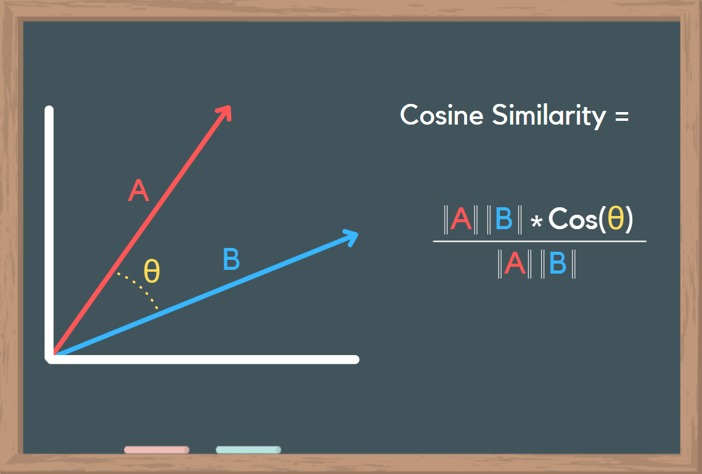
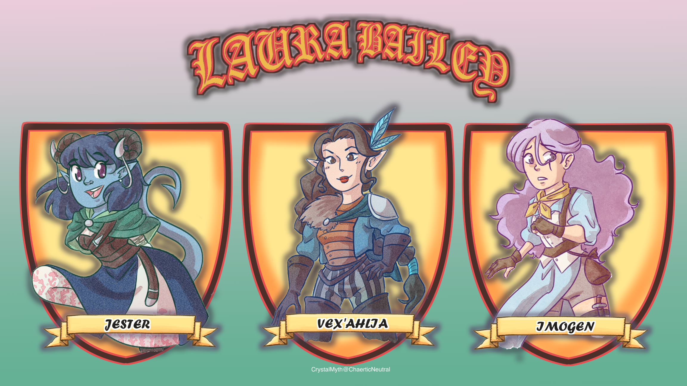

<!-- Critical Role Logo -->
 

  

<h3 align="center">Critical Role Cosine Similarity</h3>

  Am I able to use nlp techniques to distinguish casts different character

<!-- ABOUT THE REPO -->
<h2 align="left">About</h2>

  I have been binge watching critical role campaign 3 since I haven’t watched a few episodes and while we were discussing cosine similarity and nlp I decided that it would be interesting to see if my favorite actor in the campaign was good at choosing different vocabulary for her characters. 

<h3 align="left">Laura Bailey</h3>
  
