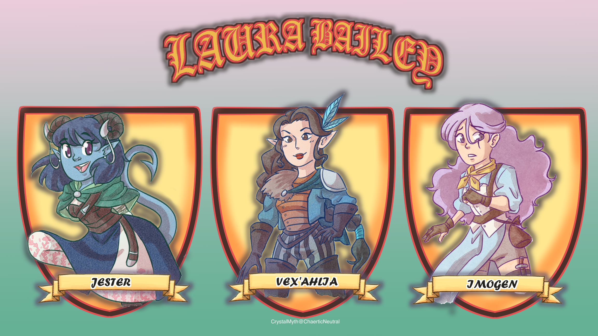

<!-- Critical Role Logo -->
 

  

<h3 align="center">Cosine Similarity</h3>

  

    Are the </a>.

  

  
  
<!-- PROJECT SHIELDS -->
[![Contributors][contributors-shield]][contributors-url]
[![Forks][forks-shield]][forks-url]
[![Stargazers][stars-shield]][stars-url]
[![Issues][issues-shield]][issues-url]
![Last Commit][last-commit-shield]

<!-- ABOUT THE REPO -->
<h2 align="left">About</h2>

&emsp;Some or none of you may know that I have a “nerdy” hobby. I love watching and playing D&D. I especially love watching Critical Role, which is a bunch of nerdy voice actors that play dungeons and dragons. (cue Travis’ “DUNGEONS AND DRAGONS”) While I have been doing natural language processing homework I have had Campaign 3 playing in the background. This sparked a lot of project ideas that answer certain questions I have.
  
  
<h3 align="left">Laura Bailey</h3>
  
